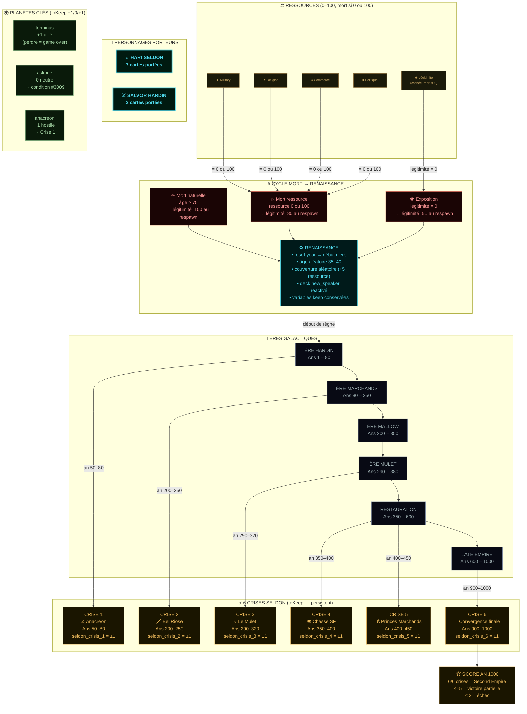

# Schéma d'enchainement des cartes — Foundation Reigns

> **30 cartes · 3 decks · 2 personnages porteurs · 1 cycle mort/renaissance**
> Généré depuis `data/foundation_cards.json`

---

## Vue d'ensemble — Architecture globale

---

## Deck 1 — `ambient` · 10 cartes · Permanent (toujours actif)

> Aucune condition d'ère. Tirages pondérés avec cooldown (lockturn).

```mermaid
flowchart TD
    classDef card fill:#0d2033,stroke:#4fd6e8,color:#c8e0f0
    classDef yes fill:#001a10,stroke:#4fd6e8,color:#a0e8c0,font-size:11px
    classDef no fill:#1a0a00,stroke:#e8b65a,color:#f0c880,font-size:11px
    classDef neutral fill:#101010,stroke:#7d8aa3,color:#9aabad,font-size:11px

    subgraph A_POL["Politique / Légitimité"]
        A1007["#1007  festival_terminus\nw:4  🔒30 tours\n😊 mood: curious\n📝 Festival public à Terminus"]:::card
        A1007_Y["◄ Prendre la parole\n→ POL +10  LEG −5\n😊 flattered"]:::yes
        A1007_N["► Déléguer\n→ POL +5\n😐 neutral"]:::no
        A1007 --> A1007_Y
        A1007 --> A1007_N

        A1009["#1009  journaliste_enquete\nw:3  🔒15 tours\n😒 mood: suspicious\n📝 Journaliste enquête sur vous"]:::card
        A1009_Y["◄ Discréditer\n→ POL −10  LEG +5\n😨 afraid"]:::yes
        A1009_N["► Inviter à une interview\n→ POL +10  LEG −10\n😊 flattered"]:::no
        A1009 --> A1009_Y
        A1009 --> A1009_N
    end

    subgraph A_COM["Commerce"]
        A1002["#1002  greve_marchands\nw:2  🔒15 tours\n😠 mood: angry\n📝 Grève des marchands locaux"]:::card
        A1002_Y["◄ Céder aux demandes\n→ COM −10  POL +5\n😐 neutral"]:::yes
        A1002_N["► Tenir ferme\n→ COM −5  POL −10\n😠 angry"]:::no
        A1002 --> A1002_Y
        A1002 --> A1002_N

        A1010["#1010  don_anonyme\nw:2  🔒30 tours\n🤔 mood: curious\n📝 Don anonyme suspect"]:::card
        A1010_Y["◄ Accepter sans questions\n→ COM +15\n😐 neutral"]:::yes
        A1010_N["► Enquêter sur l'origine\n→ COM +5  MIL +5\n😒 suspicious"]:::no
        A1010 --> A1010_Y
        A1010 --> A1010_N

        A1004["#1004  coupure_energie\nw:3  🔒20 tours\n😨 mood: afraid\n📝 Coupure d'énergie à Terminus"]:::card
        A1004_Y["◄ Réparer en urgence\n→ COM −15\n😐 neutral"]:::yes
        A1004_N["► Rationaliser l'énergie\n→ POL −10  COM −5\n😠 angry"]:::no
        A1004 --> A1004_Y
        A1004 --> A1004_N
    end

    subgraph A_MIL["Militaire / Espionnage"]
        A1001["#1001  rumeur_terminus\nw:3  🔒10 tours\n🤔 mood: curious\n📝 Rumeur de danger intérieur"]:::card
        A1001_Y["◄ Ignorer\n→ rien\n😐 neutral"]:::yes
        A1001_N["► Enquêter\n→ MIL −5\n😒 suspicious"]:::no
        A1001 --> A1001_Y
        A1001 --> A1001_N

        A1006["#1006  vieil_amiral\nw:2  🔒25 tours\n😒 mood: suspicious\n📝 Vieil amiral à recruter"]:::card
        A1006_Y["◄ L'engager\n→ MIL +10  POL −10\n😊 flattered"]:::yes
        A1006_N["► Décliner poliment\n→ rien\n😐 neutral"]:::no
        A1006 --> A1006_Y
        A1006 --> A1006_N

        A1008["#1008  espion_anacreon\nw:2  🔒20 tours\n😨 mood: afraid\n📝 Espion d'Anacréon capturé"]:::card
        A1008_Y["◄ L'emprisonner\n→ MIL +10  rel_KNG −15\n😠 angry"]:::yes
        A1008_N["► Relâcher contre infos\n→ MIL +5\n😒 suspicious"]:::no
        A1008 --> A1008_Y
        A1008 --> A1008_N
    end

    subgraph A_REL["Religion / Science"]
        A1003["#1003  etudiant_fondation\nw:4  🔒8 tours\n🤔 mood: curious\n📝 Étudiant veut les archives"]:::card
        A1003_Y["◄ Ouvrir les archives\n→ REL +5  POL −5\n😊 flattered"]:::yes
        A1003_N["► Refuser — trop tôt\n→ rien\n😢 sad"]:::no
        A1003 --> A1003_Y
        A1003 --> A1003_N

        A1005["#1005  delegation_scientifique\nw:3  🔒12 tours\n🤔 mood: curious\n📝 Délégation demande des fonds"]:::card
        A1005_Y["◄ Allouer les fonds\n→ COM −10  REL +10\n😊 flattered"]:::yes
        A1005_N["► Reporter la décision\n→ REL −5\n😢 sad"]:::no
        A1005 --> A1005_Y
        A1005 --> A1005_N
    end
```

---

## Deck 2 — `hardin_era` · 10 cartes · Ère Hardin (Ans 1–80)

> Conditions basées sur `year`, `military`, `religion`. 2 cartes avec porteur.

```mermaid
flowchart TD
    classDef card fill:#1c1200,stroke:#e8b65a,color:#f0e0b0
    classDef cond fill:#0a0800,stroke:#7d6030,color:#b09060,font-size:11px
    classDef yes fill:#001a10,stroke:#4fd6e8,color:#a0e8c0,font-size:11px
    classDef no fill:#1a0a00,stroke:#d96a5a,color:#f09080,font-size:11px
    classDef seldon fill:#001a10,stroke:#4fd6e8,stroke-width:3px,color:#4fd6e8
    classDef hardin fill:#001a10,stroke:#e8b65a,stroke-width:3px,color:#e8b65a

    GATE_HARDIN["🟡 deck hardin_era\nactif : Ère Hardin  ans 1–80"]

    GATE_HARDIN --> H2002
    GATE_HARDIN --> H2001
    GATE_HARDIN --> H2003
    GATE_HARDIN --> H2004
    GATE_HARDIN --> H2005
    GATE_HARDIN --> H2006
    GATE_HARDIN --> H2007
    GATE_HARDIN --> H2008
    GATE_HARDIN --> H2009
    GATE_HARDIN --> H2010

    H2002["#2002  pretre_scientifique\nCOND: year > 5\nw:3  🔒12\n📝 Prêtre propose la science-religion"]:::card
    H2002_C["COND: year > 5"]:::cond
    H2002_Y["◄ Encourager\n→ REL +15  POL +5\n😊 flattered"]:::yes
    H2002_N["► Neutralité\n→ REL −5\n😐 neutral"]:::no
    H2002 --> H2002_Y
    H2002 --> H2002_N

    H2001["#2001  pression_anacreon_debut\nCOND: year > 10\nw:4  🔒10\n📝 Anacréon exige des concessions"]:::card
    H2001_Y["◄ Accepter\n→ rel_KNG +15  COM −10\n😐 neutral"]:::yes
    H2001_N["► Refuser\n→ rel_KNG −20  MIL −10\n😠 angry"]:::no
    H2001 --> H2001_Y
    H2001 --> H2001_N

    H2003["#2003  encyclopedie_retard\nCOND: year < 50\nw:3  🔒20\n📝 L'Encyclopédie prend du retard"]:::card
    H2003_Y["◄ Injecter des fonds\n→ COM −20  REL +10\n😐 neutral"]:::yes
    H2003_N["► Réduire le périmètre\n→ REL −10  POL −5\n😢 sad"]:::no
    H2003 --> H2003_Y
    H2003 --> H2003_N

    H2004["#2004  noble_provincial\nCOND: year > 15\nw:2  🔒15\n📝 Noble offre un deal commercial"]:::card
    H2004_Y["◄ Accepter le deal\n→ COM +15  POL −15\n😊 flattered"]:::yes
    H2004_N["► Refuser\n→ POL +5\n😠 angry"]:::no
    H2004 --> H2004_Y
    H2004 --> H2004_N

    H2005["#2005  rumeur_seldon\nCOND: year > 45\n☼ bearer: hari_seldon\nw:3  🔒25\nLOAD: seldon_vault_opened=1 🔒keep\n📝 Message de la Crypte Seldon"]:::seldon
    H2005_Y["◄ Suivre Seldon\n→ REL +20  LEG +10\n😊 flattered"]:::yes
    H2005_N["► Agir malgré tout\n→ POL +10  LEG −15\n😒 suspicious"]:::no
    H2005 --> H2005_Y
    H2005 --> H2005_N

    H2006["#2006  traite_hardin\nCOND: year > 30  AND  religion > 40\n⚔ bearer: salvor_hardin\nw:3  🔒15\n📝 Hardin propose un traité religieux"]:::hardin
    H2006_Y["◄ Accélérer\n→ REL +15  rel_KNG +5\n😊 flattered"]:::yes
    H2006_N["► Temporiser\n→ REL +5\n😐 neutral"]:::no
    H2006 --> H2006_Y
    H2006 --> H2006_N

    H2007["#2007  attaque_frontier\nCOND: military < 40  ⚠ seuil bas\nw:2  🔒20\n📝 Attaque sur la frontière"]:::card
    H2007_Y["◄ Défense spatiale\n→ MIL −20  COM +5\n😐 neutral"]:::yes
    H2007_N["► Négocier une rançon\n→ COM −15  POL −10\n😰 desperate"]:::no
    H2007 --> H2007_Y
    H2007 --> H2007_N

    H2008["#2008  conseil_terminus\nCOND: year > 20\nw:3  🔒10\n📝 Le Conseil vote contre vous"]:::card
    H2008_Y["◄ Accepter le vote\n→ POL −15  LEG +10\n😐 neutral"]:::yes
    H2008_N["► Dissoudre le Conseil\n→ POL +20  LEG −20\n😨 afraid"]:::no
    H2008 --> H2008_Y
    H2008 --> H2008_N

    H2009["#2009  missionnaire_frontier\nCOND: year > 25  AND  religion < 60\nw:3  🔒18\n📝 Mission vers les royaumes"]:::card
    H2009_Y["◄ Envoyer missionnaires\n→ REL +10  COM −5\n🤔 curious"]:::yes
    H2009_N["► Ignorer\n→ REL −5  rel_KNG −5\n😐 neutral"]:::no
    H2009 --> H2009_Y
    H2009 --> H2009_N

    H2010["#2010  crise_approche\nCOND: 40 < year < 55\n⚔ bearer: salvor_hardin\nw:2  🔒30\n📝 La grande crise approche"]:::hardin
    H2010_Y["◄ Renforcer la religion tech\n→ REL +15\n😊 flattered"]:::yes
    H2010_N["► Renforcer les défenses\n→ MIL +15  REL −10\n😨 afraid"]:::no
    H2010 --> H2010_Y
    H2010 --> H2010_N
```

---

## Deck 3 — `new_speaker` · 10 cartes · Début de règne (après renaissance)

> Activé à chaque nouveau règne. Conditions basées sur le résultat du règne précédent (`seldon_crisis_1`, `previous_death_type`, `age`, `year`, `planet_askone_state`).

```mermaid
flowchart TD
    classDef card fill:#120d22,stroke:#b98ad6,color:#d8c0f0
    classDef cond fill:#0a0815,stroke:#5a4070,color:#9070c0,font-size:11px
    classDef yes fill:#001a10,stroke:#4fd6e8,color:#a0e8c0,font-size:11px
    classDef no fill:#1a0a00,stroke:#d96a5a,color:#f09080,font-size:11px
    classDef seldon fill:#001a10,stroke:#4fd6e8,stroke-width:3px,color:#4fd6e8
    classDef load fill:#1a0a1a,stroke:#b98ad6,color:#d8a0f0,font-style:italic,font-size:11px

    RESPAWN_IN(["♻ Début de règne"])

    RESPAWN_IN --> N3001
    RESPAWN_IN --> N3002
    RESPAWN_IN --> N3003
    RESPAWN_IN --> N3004
    RESPAWN_IN --> N3005
    RESPAWN_IN --> N3006
    RESPAWN_IN --> N3007
    RESPAWN_IN --> N3008
    RESPAWN_IN --> N3009
    RESPAWN_IN --> N3010

    N3001["#3001  nouveau_speaker_debut\nw:1  🔒0  (toujours dispo)\n☼ bearer: hari_seldon\n📝 Seldon vous accueille dans la 2e Fondation"]:::seldon
    N3001_Y["◄ Assumer l'héritage\n→ LEG +5\n😊 flattered"]:::yes
    N3001_N["► Tracer votre propre voie\n→ LEG −5\n🤔 curious"]:::no
    N3001 --> N3001_Y
    N3001 --> N3001_N

    N3002["#3002  heritage_crisis_reussie\nCOND: seldon_crisis_1 = +1 ✅\n☼ bearer: hari_seldon\nw:3  🔒0\n📝 Crise Anacréon surmontée — héritage"]:::seldon
    N3002_Y["◄ Construire sur cet acquis\n→ REL +10  POL +5\n😊 flattered"]:::yes
    N3002_N["► Rester humble\n→ rien\n🤔 curious"]:::no
    N3002 --> N3002_Y
    N3002 --> N3002_N

    N3003["#3003  heritage_crisis_ratee\nCOND: seldon_crisis_1 = −1 ❌\n☼ bearer: hari_seldon\nw:3  🔒0\n📝 Crise Anacréon échouée — héritage lourd"]:::seldon
    N3003_Y["◄ Corriger en urgence\n→ MIL −10  POL −10\n😨 afraid"]:::yes
    N3003_N["► Accepter la déviation\n→ rien\n😢 sad"]:::no
    N3003 --> N3003_Y
    N3003 --> N3003_N

    N3004["#3004  heritage_natural_death\nCOND: previous_death_type = natural ⚰\n☼ bearer: hari_seldon\nw:2  🔒0\n📝 Hommage à un Speaker mort en paix"]:::seldon
    N3004_Y["◄ Honorer sa mémoire\n→ LEG +10\n😢 sad"]:::yes
    N3004_N["► Regarder vers l'avenir\n→ rien\n😐 neutral"]:::no
    N3004 --> N3004_Y
    N3004 --> N3004_N

    N3005["#3005  mort_vieillesse_speaker\nCOND: age > 74 🧓\nw:1  🔒0\n📝 Vieillesse — moment du passage"]:::card
    N3005_Y["◄ Transmettre en paix\n→ death_type = 0 (mort nat.)\n😐 neutral"]:::yes
    N3005_LOAD["LOAD: déclenche mort naturelle"]:::load
    N3005 --> N3005_Y
    N3005 --> N3005_LOAD

    N3006["#3006  contexte_ere_hardin\nCOND: year < 80\nw:3  🔒0\n📝 Briefing ère Hardin"]:::card
    N3006_Y["◄ Évaluer la menace militaire\n→ MIL +5\n😐 neutral"]:::yes
    N3006_N["► Renforcer légitimité civile\n→ LEG +5\n🤔 curious"]:::no
    N3006 --> N3006_Y
    N3006 --> N3006_N

    N3007["#3007  contexte_ere_marchands\nCOND: 79 < year < 250\nw:3  🔒0\n📝 Briefing ère des Marchands"]:::card
    N3007_Y["◄ Exploiter l'essor commercial\n→ COM +10\n😊 flattered"]:::yes
    N3007_N["► Distance prudente\n→ POL +5\n😒 suspicious"]:::no
    N3007 --> N3007_Y
    N3007 --> N3007_N

    N3008["#3008  contexte_ere_mulet\nCOND: 289 < year < 380\n☼ bearer: hari_seldon\nw:3  🔒0\n📝 Le Mulet — l'imprévisible approche"]:::seldon
    N3008_Y["◄ Chercher le Mulet\n→ MIL −10\n😨 afraid"]:::yes
    N3008_N["► Protéger les structures\n→ POL −10\n😨 afraid"]:::no
    N3008 --> N3008_Y
    N3008 --> N3008_N

    N3009["#3009  planetes_heritage\nCOND: planet_askone_state = +1 🌍\nw:2  🔒0\n📝 Askone est allié — héritage planétaire"]:::card
    N3009_Y["◄ Consolider les alliés\n→ POL +10\n😐 neutral"]:::yes
    N3009_N["► S'étendre\n→ MIL −5  COM +10\n🤔 curious"]:::no
    N3009 --> N3009_Y
    N3009 --> N3009_N

    N3010["#3010  quete_regn_assignee\n☼ bearer: hari_seldon\nw:2  🔒0\nLOAD: quest_reign_1_active=1 🔒keep\n📝 Seldon vous confie une mission"]:::seldon
    N3010_LOAD["LOAD: active quête du règne\n(quest_reign_1_active = 1)"]:::load
    N3010_Y["◄ Accepter la mission\n→ rien  🤔"]:::yes
    N3010_N["► Demander des précisions\n→ rien  🤔"]:::no
    N3010 --> N3010_LOAD
    N3010 --> N3010_Y
    N3010 --> N3010_N
```

---

## Tableau de synthèse des conditions

| Carte | Deck | Condition | Déclencheur |
|-------|------|-----------|-------------|
| #2002 pretre_scientifique | hardin_era | `year > 5` | Début de partie |
| #2001 pression_anacreon | hardin_era | `year > 10` | Peu après le début |
| #2004 noble_provincial | hardin_era | `year > 15` | Mi-début |
| #2008 conseil_terminus | hardin_era | `year > 20` | Mi-début |
| #2009 missionnaire_frontier | hardin_era | `year > 25 AND religion < 60` | Mi-jeu + religion basse |
| #2006 traite_hardin | hardin_era | `year > 30 AND religion > 40` | Mi-jeu + religion haute |
| #2003 encyclopedie_retard | hardin_era | `year < 50` | Début → mi-jeu |
| #2010 crise_approche | hardin_era | `40 < year < 55` | Fenêtre étroite pré-crise 1 |
| #2005 rumeur_seldon | hardin_era | `year > 45` | Approche de la crise |
| #2007 attaque_frontier | hardin_era | `military < 40` ⚠ | Faiblesse militaire |
| #3006 contexte_ere_hardin | new_speaker | `year < 80` | Ère Hardin |
| #3007 contexte_ere_marchands | new_speaker | `79 < year < 250` | Ère Marchands |
| #3008 contexte_ere_mulet | new_speaker | `289 < year < 380` | Ère Mulet |
| #3002 heritage_crisis_reussie | new_speaker | `seldon_crisis_1 = 1` ✅ | Crise 1 réussie |
| #3003 heritage_crisis_ratee | new_speaker | `seldon_crisis_1 = -1` ❌ | Crise 1 échouée |
| #3004 heritage_natural_death | new_speaker | `previous_death_type = natural` | Mort douce du règne précédent |
| #3005 mort_vieillesse | new_speaker | `age > 74` | Vieillesse |
| #3009 planetes_heritage | new_speaker | `planet_askone_state = 1` | Askone allié |
| #3001, #3010 | new_speaker | _(aucune)_ | Toujours disponibles en début de règne |

---

## Tableau des effets par ressource

| Ressource | Gains possibles (max) | Pertes possibles (max) | Cartes concernées |
|-----------|----------------------|------------------------|-------------------|
| **MIL** `▲` | +20 (vieil_amiral×2 scén.) | −20 (attaque_frontier G) | 1001,1006,1007,2001,2007,2010,3005,3008 |
| **REL** `✦` | +20 (rumeur_seldon G) | −10 (encyclopedie D, crise_approche D) | 1003,1005,2002,2003,2005,2006,2009,2010 |
| **COM** `●` | +15 (don_anonyme G) | −20 (encyclopedie G) | 1002,1004,1005,1010,2001,2003,2004,2007,2009 |
| **POL** `■` | +20 (conseil_terminus D) | −15 (noble_provincial G) | 1002,1003,1006,1007,1009,2002,2004,2008,3006,3007 |
| **LEG** `◉` | +10 (rumeur_seldon G / conseil G / heritage_nat G) | −20 (conseil_terminus D) | 1007,1009,2005,2008,3001,3002,3004 |

---

## Variables persistantes (toKeep — survivent à la mort)

| Variable | Type | Définie par | Lue par |
|----------|------|-------------|---------|
| `seldon_vault_opened` | flag | #2005 loadOutcome | — (future) |
| `quest_reign_1_active` | flag | #3010 loadOutcome | — (future) |
| `planet_askone_state` | −1/0/+1 | GalaxyMap / cartes planète | #3009 condition |
| `seldon_crisis_1` | ±1 | cartes `crisis_1` (à venir) | #3002 / #3003 conditions |
| `previous_death_type` | natural/resource/exposed | RespawnSystem | #3004 condition |

---

*Généré le 2026-06-10 — 30 cartes · 3 decks · 0 tunnels `link` actifs (à implémenter)*
